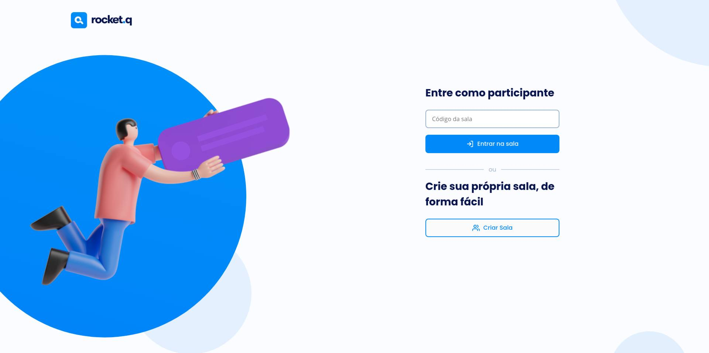

# NLW ROCKETQ 🚀

## 🌟 Tecnologias utilizadas

- [Node.js](https://nodejs.org/en/)
- [JavaScript](https://www.javascript.com/)
- [HTML](https://developer.mozilla.org/en-US/docs/Web/HTML)
- [EJS](https://ejs.co/)
- [Express](https://expressjs.com/)

## 🙋🏼 Projeto

O NLW RocketQ é uma plataforma com várias salas para a realizar perguntas anônimas

## 😶‍🌫️ Como executar

- Clone o repositório
- Rode o "npm" para baixar as dependências
- Rode o comando "node src/db/init.js" para inicializar o banco de dados
- Rode "npm start" para rodar a aplicação
